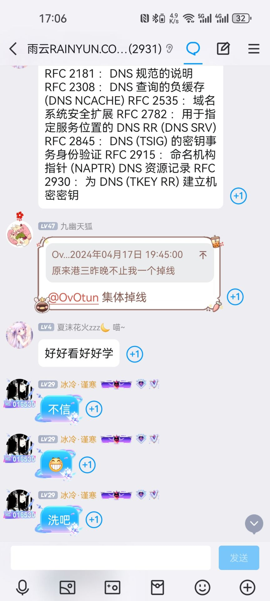
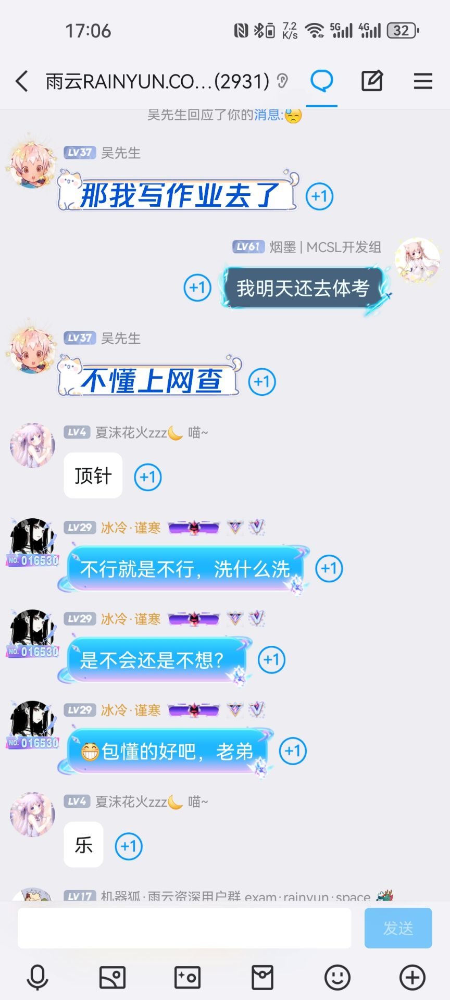
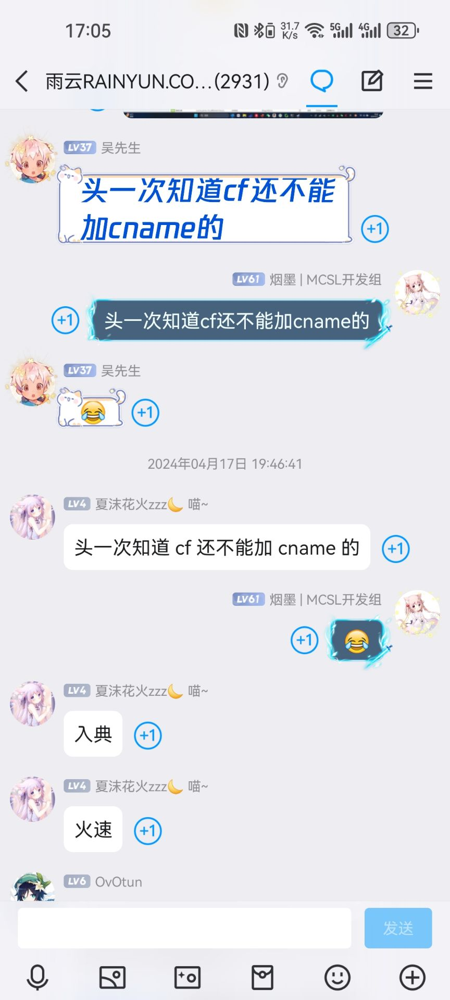

# CF不能加CNAME记录哥

> 某天晚上水群ing...
突然窜出来一个主页写着“idcxxx”的人说  
> CF真是垃圾，不能用其他家的cdn  

刚开始群友们以他问的是“再用Cloudflare CDN的情况下无法用别家的CDN”，于是对他科普了SaaS。  
没想到这哥们问的是不能加CNAME记录。然后丢出了一张截图。底下明明白白的写着“同一个主机名不能在拥有A记录的情况下添加CNAME记录”  
于是群友们让他翻译一下底下的句子  
他不翻译，然后开始骂人急眼。  
并且表示“不信”

  

接下来我不想与弱智争辩，便表示“写作业去了”。  
结果被乐子质疑了能力。  

    

随后在群友的调侃中乐子选择沉默。  
总结：  
  